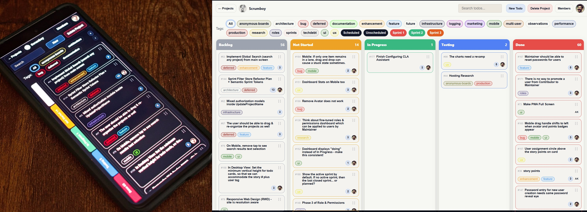

<p align="center">
  
  <br />
  
  <a href="LICENSE">
    
  </a>
</p>

#### Self-hosted project management & issue-tracking solution + instant shareable & customizable boards + realtime collaboration, automation, API access and MCP-compatible client support




## Table of contents

- [Quick Start](#quick-start)
  - [Run with Docker](#run-with-docker)
  - [Run from source](#run-from-source)
- [Optional Configuration](#optional-configuration)
  - [Environment variables](#environment-variables)
  - [Encryption key (optional)](#encryption-key-optional)
  - [OIDC / SSO login (optional)](#oidc--sso-login-optional)
  - [TLS / HTTPS (optional)](#tls--https-optional)
  - [Frontend build note](#frontend-build-note)
- [Why Scrumboy?](#why-scrumboy)
- [Who is this for?](#who-is-this-for)
- [Modes](#modes)
- [Features](#features)
- [Integrations & API Access](#integrations--api-access)
  - [MCP (JSON-RPC) for AI agents](#mcp-json-rpc-for-ai-agents)
  - [Webhooks (outbound HTTP)](#webhooks-outbound-http)
- [Config](#config)
- [Roles](#roles)
  - [System roles (instance-wide)](#system-roles-instance-wide)
  - [Project roles (per project)](#project-roles-per-project)
- [Export scope](#export-scope)
- [Import modes](#import-modes)
- [Code layout (reference)](#code-layout-reference)
- [Documentation](#documentation)
- [License and Contributions](#license-and-contributions)

## Quick Start

Runs in seconds. No setup required.

No `.env` file, TLS certificates, or encryption key are required to start the app.

### Run with Docker

```bash
docker compose up --build
```

Open [http://localhost:8080](http://localhost:8080).

### Run from source

```bash
go run ./cmd/scrumboy
```

Open [http://localhost:8080](http://localhost:8080).

## Optional Configuration

### Environment variables

Note: `scrumboy.env` is not a standard KEY=value file — it contains only the raw encryption key on a single line.

- The app does **not** automatically load `.env` files.
- On Linux/macOS, export variables manually (for example: `export SCRUMBOY_ENCRYPTION_KEY=...`).
- Windows helper scripts load `scrumboy.env` automatically.

### Encryption key (optional)

- `SCRUMBOY_ENCRYPTION_KEY` is **not** required for basic startup.
- It is required for:
  - 2FA
  - Password reset flows
- If an existing database already has 2FA-enabled users, startup fails without this key.

Generate a key with: `openssl rand -base64 32`

### OIDC / SSO login (optional)

Scrumboy supports OpenID Connect for single sign-on with any standards-compliant provider (Keycloak, Authentik, Auth0, Entra ID, etc.). OIDC is enabled by setting all four required environment variables:

| Variable | Description |
|----------|-------------|
| `SCRUMBOY_OIDC_ISSUER` | Issuer URL (e.g. `https://auth.example.com/realms/main`) |
| `SCRUMBOY_OIDC_CLIENT_ID` | OAuth client ID |
| `SCRUMBOY_OIDC_CLIENT_SECRET` | Confidential client secret |
| `SCRUMBOY_OIDC_REDIRECT_URL` | Full callback URL registered at IdP (e.g. `https://scrumboy.example.com/api/auth/oidc/callback`) |

Optional:

| Variable | Description |
|----------|-------------|
| `SCRUMBOY_OIDC_LOCAL_AUTH_DISABLED` | Set to `true` to disable local password login when OIDC is configured (SSO-only mode) |

Local password authentication remains available by default alongside OIDC. After successful OIDC login, the user receives a standard Scrumboy session cookie. The IdP must return a verified email (`email_verified: true`). HTTPS is recommended when using OIDC to ensure session cookies are `Secure`.

See [`docs/oidc.md`](docs/oidc.md) for full setup details, constraints, and troubleshooting.

### TLS / HTTPS (optional)

- TLS is optional.
- HTTPS is enabled only when both `SCRUMBOY_TLS_CERT` and `SCRUMBOY_TLS_KEY` files exist.
- Otherwise, the server runs on HTTP by default.

### Frontend build note

The Docker image and `go run` embed prebuilt assets under `internal/httpapi/web/dist`. If they are missing, build them:

```bash
cd internal/httpapi/web
npm install
npx tsc
```

Then run `docker compose up --build` or `go run ./cmd/scrumboy` again from the repository root.


# Why Scrumboy?

Simplicity of a light Kanban, with the power of structured systems: Roles, sprints, audit trails & customizable workflows - without being locked into SaaS tools. 


# Who is this for?

- self-hosted & privacy-focused community
- small to medium-sized teams & solo builders

# Modes

- **Full** (`SCRUMBOY_MODE=full`, default): Auth can be enabled. First user via bootstrap; then login/session. Backup/export, tags, multi-project. Projects can be user-owned (project_members) or anonymous (shareable by URL): `/anon` (or `/temp`) creates a throwaway board and redirects to `/{slug}`.

- **Anonymous** (`SCRUMBOY_MODE=anonymous`): No auth. Landing at `/`; live deployment at: https://scrumboy.com/


# Features

- Custom Workflows: You can create any combination of workflow you want, per project, with user-defined "Done" lane.

- Realtime SSE enabled boards for instant multi-user actions.

- **Webhooks (API-only, full mode):** Register URLs per project so Scrumboy can POST JSON when subscribed domain events fire (e.g. `todo.assigned`). For your own automations—not in-app or browser notifications. See [Integrations](#integrations--api-access).

- Customizable Tags: Users can inherit and customize tag colors.

- Advanced filtering: Search todos based on text or tags.

- Sprints: create, activate, close; sprint filter on board; default sprint weeks (1 or 2) per project.

- Authentication & 2FA: TOTP supported when `SCRUMBOY_ENCRYPTION_KEY` is set.

- Audit trail: append-only `audit_events` table; todo/member/project/link actions logged (see `docs/AUDIT_TRAIL.md`).

- Backup: export/import JSON; merge or replace; scope full or single project (see store backup logic).

- PWA: Excellent UX for mobile users.

- Anonymous shareable boards can be created in both Full & Anonymous deployments.

---

## Integrations & API Access

Scrumboy supports API access tokens for automation, integrations, and programmatic MCP access (legacy HTTP and JSON-RPC — see below).

You can create a token from the API and use it to call MCP endpoints directly — no browser session or cookies required.

**Create a token (requires login session):**

```bash
curl -b cookies.txt -X POST http://localhost:8080/api/me/tokens \
  -H "Content-Type: application/json" \
  -H "X-Scrumboy: 1" \
  -d '{"name":"cli"}'
```

Response includes a one-time token (starts with sb_).

Use it with MCP:

```bash
curl -X POST http://localhost:8080/mcp \
  -H "Content-Type: application/json" \
  -H "Authorization: Bearer sb_your_token_here" \
  -d '{"tool":"projects.list","input":{}}'
```

### MCP (JSON-RPC) for AI agents

Scrumboy exposes a **Model Context Protocol (MCP) compatible JSON-RPC endpoint** for AI agents (Claude, etc.) and MCP-compatible clients.

**Endpoint:** `POST /mcp/rpc`

This is separate from the `/mcp` HTTP endpoint above and follows **JSON-RPC 2.0** (`initialize`, `tools/list`, `tools/call`, etc.). See [`API.md`](API.md) for full detail.

#### Example: `initialize`

```bash
curl -X POST http://localhost:8080/mcp/rpc \
  -H "Content-Type: application/json" \
  -d '{"jsonrpc":"2.0","id":1,"method":"initialize","params":{}}'
```

#### Example: list tools

```bash
curl -X POST http://localhost:8080/mcp/rpc \
  -H "Content-Type: application/json" \
  -d '{"jsonrpc":"2.0","id":2,"method":"tools/list","params":{}}'
```

#### Example: call a tool

```bash
curl -X POST http://localhost:8080/mcp/rpc \
  -H "Content-Type: application/json" \
  -H "Authorization: Bearer sb_your_token_here" \
  -d '{
    "jsonrpc":"2.0",
    "id":3,
    "method":"tools/call",
    "params":{
      "name":"todos.create",
      "arguments":{
        "projectSlug":"my-project",
        "title":"Created via MCP"
      }
    }
  }'
```

**Notes**

- Compatible with MCP clients that support **HTTP JSON-RPC** to this URL.
- Some MCP clients expect **stdio**-based servers — those are **not** supported here.
- Authentication works via **session cookie** or **Bearer** token (same rules as `/mcp`).

This enables:

- CLI usage
- CI/CD automation
- AI agents and MCP clients (use **`POST /mcp/rpc`** for JSON-RPC; **`POST /mcp`** remains available for the legacy `{ "tool", "input" }` envelope)
- Scripting/integrations without login flows

### Webhooks (outbound HTTP)

Scrumboy can **POST JSON to URLs you register** when certain events occur. This is for **server-side integrations** (your script, gateway, queue worker, etc.). It does **not** add notifications inside the Scrumboy UI; live boards still update via **SSE** as before.

- **Availability:** **Full mode only** (endpoints are disabled in anonymous mode).
- **Who can configure:** Project **maintainers**, via the HTTP API only—there is **no settings screen** for webhooks yet.
- **API:** `POST /api/webhooks` (create), `GET /api/webhooks` (list yours), `DELETE /api/webhooks/{id}` — same session cookie / CSRF header rules as other mutating `/api/*` calls.
- **Events:** Subscribe to specific types (e.g. `todo.assigned`) or `*` for all delivered types. The set may grow over time; unused types in your list are harmless.
- **Security:** Optional per-webhook **secret**; when set, requests include an `X-Scrumboy-Signature` header (`sha256=` HMAC of the raw JSON body).
- **Semantics:** Best-effort delivery with retries on failure; not a durable external queue—design for idempotent receivers using the event `id` in the JSON body.

Example create (replace cookie / project id / URL):

```bash
curl -b cookies.txt -X POST http://localhost:8080/api/webhooks \
  -H "Content-Type: application/json" \
  -H "X-Scrumboy: 1" \
  -d '{"projectId":1,"url":"https://example.com/scrumboy-hook","events":["todo.assigned"],"secret":"optional-shared-secret"}'
```


# Config

Env vars and defaults are defined in `internal/config/config.go`. ResolveDataDir uses `DATA_DIR` and `SQLITE_PATH` as documented there.
None of these are required for basic startup.

| Variable | Default (from code) |
|----------|---------------------|
| `BIND_ADDR` | `:8080` |
| `DATA_DIR` | `./data` |
| `SQLITE_PATH` | (empty; then `$DATA_DIR/app.db`) |
| `SQLITE_BUSY_TIMEOUT_MS` | `30000` |
| `SQLITE_JOURNAL_MODE` | `WAL` |
| `SQLITE_SYNCHRONOUS` | `FULL` |
| `MAX_REQUEST_BODY_BYTES` | `1048576` (1 MiB) |
| `SCRUMBOY_MODE` | `full` (or `anonymous`) |
| `SCRUMBOY_ENCRYPTION_KEY` | (empty) - **Required for 2FA.** Base64-encoded 32-byte key. Generate with `openssl rand -base64 32`. Without it, 2FA setup returns 503. |
| `SCRUMBOY_TLS_CERT` | `./cert.pem` - TLS cert for HTTPS |
| `SCRUMBOY_TLS_KEY` | `./key.pem` - TLS key for HTTPS |
| `SCRUMBOY_INTRANET_IP` | `192.168.1.250` - LAN IP to log for intranet access |

`docker-compose.yml` overrides some of these (e.g. `SQLITE_BUSY_TIMEOUT_MS=5000`).

---

# Roles

In **full mode**, access is governed by two separate role systems. System roles do not grant project access; project access comes only from project membership.

### System roles (instance-wide)

| Role   | Who has it | Allowed actions |
|--------|------------|------------------|
| **Owner** | Bootstrap (first) user; can be assigned by another owner | List all users; create users (admin-only API); update any user’s system role (owner/admin/user); delete users (except cannot delete the last owner). |
| **Admin** | Assigned by an owner | List all users; create users. Cannot change system roles or delete users. |
| **User**  | Default for new users; assigned by owner | No system-level user management. Access to projects only via project membership. |


### Project roles (per project)

A user must be a member of a project to access it; system role alone does not grant access.

| Role          | View board & todos | Create/edit/move/delete todos | Edit body when assigned | Manage members | Delete project | Tag delete/color (project-scoped) |
|---------------|--------------------|-------------------------------|--------------------------|----------------|----------------|-----------------------------------|
| **Maintainer**| ✓                  | ✓                             | ✓                        | ✓              | ✓              | ✓ (maintainer)                    |
| **Contributor**| ✓                 | -                             | ✓ (body only)            | -              | -              | -                                 |
| **Viewer**    | ✓                  | -                             | -                        | -              | -              | -                                 |

- **View** (board, backlog, burndown, charts, etc.): Any project role (Viewer or above).
- **Create/edit/move/delete todos, assign, sprints**: Maintainer only. Contributor cannot create, delete, move, or assign; cannot edit title, tags, sprint, or estimation.
- **Edit body when assigned**: Contributor can edit the body field only when the todo is assigned to them. Maintainer has full edit.
- **Manage members** (add/remove members, change role): Maintainer only.
- **Delete project**: Maintainer only.
- **Delete/update tag** (project-scoped tags): Maintainer only. User-owned tags: owner of the tag or maintainer in all projects where the tag is used.
- **Create tags**: Contributor or Maintainer.

Temporary/anonymous boards (shareable by URL, no auth) do not use project roles; anyone with the link can view and edit. New Todo and drag-and-drop are enabled for anonymous boards.

---


# Export scope

- **Full**: All projects the user can access (full mode: projects where the user is a member, or temporary boards they created; anonymous mode: not applicable for full export).
- **Single project**: One board/project only (e.g. current board in anonymous mode).

# Import modes

When importing a backup JSON, you choose how it is applied:

| Mode | Description |
|------|-------------|
| **Replace** | Replace all: delete every project in your current export scope, then create projects from the backup. Effect is “nuke and restore” so the instance matches the backup. Not available in anonymous mode. |
| **Merge** | Merge/update: for each project in the backup, match by slug. If a project with that slug exists (and you have access), update its todos, tags, and links to match the backup; otherwise create a new project. In anonymous mode, merge behaves like Create Copy (all projects are created as new). |
| **Create copy** | Create copy: create new projects for every project in the backup. Slugs are made unique (e.g. `name-imported-2`), so nothing is overwritten; you get duplicates. |

In **anonymous mode**, full-scope import is not allowed; you can only import into the current board (todos and tags are added to that board).

---

# Code layout (reference)

- `cmd/scrumboy`: main server entrypoint. Other `cmd/*` are utilities (tagcheck, tagrecover, dbquery, slugfix).
- `internal/config`: env-based config.
- `internal/version`: app and export format version.
- `internal/db`: SQLite open/options (PRAGMAs from config).
- `internal/migrate`: DB migrations.
- `internal/store`: data model and persistence (projects, todos, tags, auth, backup, ordering, memberships, audit, links, sprints, workflows, etc.).
- `internal/httpapi`: HTTP server, routing, auth cookies, SPA serve, embedded web FS.
- `internal/httpapi/web`: frontend (TS, CSS, HTML); built with `npx tsc` in `internal/httpapi/web`; output under `web/dist` and embedded by server.

Invariants (e.g. canonical URL `/{slug}`, no UI links to `/p/{id}`) are enforced in code and tests; see `internal/httpapi` and `internal/store` for the authoritative behavior.

---

# Documentation

- **Roles and permissions:** `docs/ROLES_AND_PERMISSIONS.md` - project roles, backend authorization, anonymous boards.
- **Audit trail:** `docs/AUDIT_TRAIL.md` - action vocabulary, event model, integration points.

---

# License and Contributions

Scrumboy is licensed under the **GNU Affero General Public License v3** (AGPL v3). See [LICENSE](LICENSE) for the full text.

**Contributing:** Contributors must sign the [Contributor License Agreement (CLA)](CLA.md) before contributions are accepted. See [CONTRIBUTING.md](CONTRIBUTING.md) for setup, build, and pull request guidelines.

Scrumboy is a passion project. We hope you will ❤️ it as much as we do!
