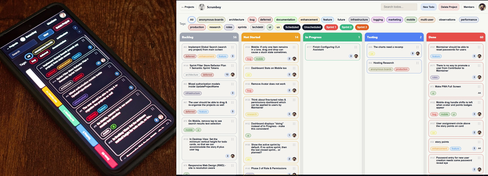

<p align="center">
  
  <br />
  
  <a href="LICENSE"></a>
  
  <a href="https://github.com/markrai/scrumboy/actions/workflows/ci.yml"></a>
  <a href="SECURITY.md"></a>
  <a href="https://scorecard.dev/viewer/?uri=github.com/markrai/scrumboy"></a>
</p>


#### Self-hosted project management & issue-tracking solution + instant shareable & customizable boards + realtime collaboration, automation, API access and MCP-compatible client support and zero SaaS lock-in




## Table of contents

- [Quick Start](#quick-start)
  - [Run the official Docker image](#run-the-official-docker-image)
  - [Build locally from source](#build-locally-from-source)
  - [Run from source](#run-from-source)
  - [Run the Windows executable](#run-the-windows-executable)
  - [Run the macOS executable](#run-the-macos-executable)
  - [Build the Android app](#build-the-android-app)
- [Features](#features)
- [Modes](#modes)
- [Roles](#roles)
  - [System roles (instance-wide)](#system-roles-instance-wide)
  - [Project roles (per project)](#project-roles-per-project)
- [Optional Configuration](#optional-configuration)
  - [Environment variables](#environment-variables)
  - [Encryption key for 2FA/password reset](#encryption-key-for-2fapassword-reset)
  - [SMTP for self-service password reset (optional)](#smtp-for-self-service-password-reset-optional)
  - [Email notifications (optional)](#email-notifications-optional)
  - [OIDC / SSO login (optional)](#oidc--sso-login-optional)
  - [Owner disaster recovery](#owner-disaster-recovery)
  - [TLS / HTTPS (optional)](#tls--https-optional)
  - [PWA / Web Push (optional)](#pwa--web-push-optional)
- [Integrations & API Access](#integrations--api-access)
  - [MCP (JSON-RPC) for AI agents](#mcp-json-rpc-for-ai-agents)
  - [Webhooks (outbound HTTP)](#webhooks-outbound-http)
- [Export scope](#export-scope)
- [Import modes](#import-modes)
- [Documentation](#documentation)
- [License and Contributions](#license-and-contributions)


## Quick Start

Runs in seconds. No setup required.

No `.env` file, TLS certificates, or encryption key are required to start the app.

Scrumboy creates runtime data under `./data` by default. The default SQLite database is `./data/app.db`, and SQLite may also create `app.db-wal` and `app.db-shm` while the server is running.  

### Run the official Docker image

Pull `ghcr.io/markrai/scrumboy:latest` (Docker selects the published architecture for your host):

```bash
docker run -d \
  --name scrumboy \
  -p 127.0.0.1:8080:8080 \
  -v scrumboy-data:/data \
  ghcr.io/markrai/scrumboy:latest
```

The mounted `/data` volume preserves Scrumboy data across container recreation. Open [http://localhost:8080](http://localhost:8080). For Compose using the published image, persistence, backup, and configuration details, see [docs/docker.md](docs/docker.md).

### Build locally from source

To build from a local clone instead of pulling the published image:

```bash
docker compose up --build
```

The repository's `docker-compose.yml` uses `build: .` and maps `./data` to `/data`.

Open [http://localhost:8080](http://localhost:8080).  

### Run from source

```bash
go run ./cmd/scrumboy
```

Open [http://localhost:8080](http://localhost:8080).    

### Run the Windows executable

Windows users can download the `windows-amd64` executable from [GitHub Releases](https://github.com/markrai/scrumboy/releases). Run it from a dedicated writable folder (for example `%USERPROFILE%\Scrumboy`); it starts a local Scrumboy server at [http://localhost:8080](http://localhost:8080). For exact artifact filenames, checksum and provenance verification, runtime-data location, and other release-install details, see [docs/install-from-releases.md](docs/install-from-releases.md).

### Run the macOS executable

macOS users can download Apple Silicon or Intel builds from [GitHub Releases](https://github.com/markrai/scrumboy/releases). These binaries require **macOS 12 Monterey or later**. Extract and run `./scrumboy` from a dedicated writable folder; it starts a local Scrumboy server at [http://localhost:8080](http://localhost:8080). Current macOS release binaries are not Apple-signed or notarized. For exact artifact filenames, checksum and provenance verification, runtime-data location, Gatekeeper/quarantine troubleshooting, and other release-install details, see [docs/install-from-releases.md](docs/install-from-releases.md).

### Build the Android app

Scrumboy includes a native Android client, implemented with Capacitor, under `mobile/capacitor`. It connects to a running Scrumboy server; it does not replace or start the server. Build it from source. Release builds require HTTPS to that server. Prerequisites, web-payload packaging, Gradle commands, device connection, and optional signing are in [docs/android.md](docs/android.md).

---

# Features

- Custom Workflows: You can create any combination of workflow you want, per project, with user-defined "Done" lane.
- Custom Priority Tiers: each project has ordered, color-coded priority definitions with stable keys; maintainers configure tiers and assign them to todos.
- Realtime SSE enabled boards for instant multi-user actions.
- **Webhooks (API-only, full mode):** Register URLs per project so Scrumboy can POST JSON when subscribed domain events fire (e.g. `todo.assigned`). For your own automations, not in-app or browser notifications. See [Integrations](#integrations--api-access).
- Customizable Tags: Users can inherit and customize tag colors.
- Advanced filtering: on desktop, the default compact Omni control shows recently active project tags when search is empty, narrows immediately to matching tag suggestions while typing, and provides arrows for paging the candidate shelf. Mobile retains its compact single rail for pinned tags and typed matches. Multiple pinned tags use logical AND and compose with ordinary text search, sprint, and other URL filters. The previous permanent tag/sprint pills remain available as **Legacy pills** under Settings → Customization.
- Sprints: create, activate, close; sprint filter on board; default sprint weeks (1 or 2) per project. Maintainers can disable sprints per project without deleting sprint history or todo assignments, then re-enable them later.
- **Story archival:** Archive and restore one story or a selection without touching workflow state or history - lane, rank, `doneAt`, tags, links, sprint, priority and assignment are preserved, so metrics and sprint history are unaffected. Every board reader can browse the cursor-paginated Archive and inspect archived stories in a clearly marked read-only detail view; maintainers (and temporary-board capability holders) can restore or hard-delete them. Archived stories drop out of board, search and dashboard reads while still counting for integrity checks. The same single and atomic batch (1-500) operations are available over REST and MCP. Nothing is archived automatically. See [API.md](API.md) and [docs/mcp.md](docs/mcp.md).
- Authentication & 2FA: TOTP supported when `SCRUMBOY_ENCRYPTION_KEY` is set.
- Self-service password reset email (optional, requires SMTP + `SCRUMBOY_ENCRYPTION_KEY` + `SCRUMBOY_PUBLIC_BASE_URL`): see [docs/smtp.md](docs/smtp.md).
- Audit trail: append-only `audit_events` table; todo/member/project/link actions logged (see [docs/audit-trail.md](docs/audit-trail.md)).
- Backup: export/import JSON; merge or replace; scope full or single project. JSON export is not a complete `DATA_DIR` disaster-recovery backup (uploaded wallpapers and `audit_events` are omitted); see [docs/diagrams/scrumboy_deployment_ops.md](docs/diagrams/scrumboy_deployment_ops.md).
- Trello import: migrate an existing Trello board from its JSON export, with a preview before anything is imported (see [docs/backup-and-import.md](docs/backup-and-import.md)).
- Mobile: Native Android app (Capacitor client; build from source — [docs/android.md](docs/android.md)) with native VoiceFlow on supported devices, or install the [PWA](docs/pwa.md) from the browser.
- Multi-language Support: English, 简体中文, हिन्दी, Español (Latinoamérica), العربية, Français, বাংলা, Português (Brasil), Bahasa Indonesia, اردو, Русский, Deutsch, 日本語, Kiswahili, Tiếng Việt, Türkçe, 한국어, فارسی, ไทย, Italiano, Bahasa Melayu, Polski, and Українська.
- Anonymous shareable boards can be created in both Full & Anonymous deployments.
- VoiceFlow - deterministic voice commands in the browser; on supported Android devices, **AI VoiceFlow** adds on-device speech and Gemini Nano planning with confirmation before mutations (see [docs/voiceflow.md](docs/voiceflow.md), [docs/enhanced-voiceflow.md](docs/enhanced-voiceflow.md)).
- Sticky-Note Wall - per-project scratchpad of draggable sticky notes on the board (see [docs/wall.md](docs/wall.md)).
- Agenda - today's events from subscribed ICS feeds on durable boards (see [docs/calendar.md](docs/calendar.md)). Requires `SCRUMBOY_ENCRYPTION_KEY`.
- Todo notes Markdown preview (optional) - **markdown** / **preview** tabs in the todo Notes field; optional Mermaid diagrams in fenced ````mermaid`blocks in preview only (see [FAQ.md](FAQ.md), [docs/markdown-and-mermaid.md](docs/markdown-and-mermaid.md)).

# Modes

- **Full** (`SCRUMBOY_MODE=full`, default): Auth can be enabled. First user via bootstrap; then login/session. Backup/export, tags, multi-project. Projects can be user-owned (project_members) or anonymous (shareable by URL): `/anon` (or `/temp`) creates a throwaway board and redirects to `/{slug}`.
- **Anonymous** (`SCRUMBOY_MODE=anonymous`): No auth. Landing at `/`; live deployment at: [https://scrumboy.com/](https://scrumboy.com/)

# Roles

In **full mode**, access is governed by two separate role systems: instance-wide system roles (**Owner**, **Admin**, **User**) and per-project roles. System roles do not grant project access; project access comes only from project membership.

### System roles (instance-wide)

Owner, Admin, and User control instance-wide capabilities such as user management. Assignment rules and permissions: [docs/roles-and-permissions.md](docs/roles-and-permissions.md).

### Project roles (per project)

Project access requires project membership. Per-project roles are **Maintainer** (full project management), **Contributor** (limited edits, including body editing on cards assigned to them), and **Viewer** (read-only). Temporary/anonymous boards use a separate link-based permission model instead of these roles. Details: [docs/roles-and-permissions.md](docs/roles-and-permissions.md).

---


## Optional Configuration


### Environment variables

A fresh Scrumboy install needs no environment variables. Set them only when you want to change deployment defaults or turn on optional features (SSO, email, Web Push, TLS, encryption, and similar).

Scrumboy does **not** automatically load `.env` files. Inject variables through your shell, process manager, Docker/Compose, or another launcher.

Full names, defaults, requirements, and interactions: [docs/environment-variables.md](docs/environment-variables.md).

---


### Encryption key for 2FA/password reset

`SCRUMBOY_ENCRYPTION_KEY` is **not** required for basic Scrumboy startup. It is required for features that store encrypted authentication/security or calendar data, including 2FA and Agenda calendar feeds. Once encrypted data exists, back up and restore the key with the Scrumboy data; do not casually replace it. Details: [docs/environment-variables.md](docs/environment-variables.md#scrumboy_encryption_key) and [FAQ.md](FAQ.md#how-do-i-generate-scrumboy_encryption_key).

### SMTP for self-service password reset (optional)

Optional SMTP enables self-service password-reset email (**Forgot your Scrumboy password?**) for users with a usable Scrumboy-local password; it also depends on `SCRUMBOY_ENCRYPTION_KEY` and a valid `SCRUMBOY_PUBLIC_BASE_URL`. SSO credential recovery remains the identity provider's responsibility. Setup and troubleshooting: [docs/smtp.md](docs/smtp.md).

### Email notifications (optional)

Optional email notifications use the same SMTP configuration as password-reset email. They are opt-in per user under Settings → Customization, including per-category choices, and do not require `SCRUMBOY_ENCRYPTION_KEY`. Setup and category/recipient details: [docs/notifications.md](docs/notifications.md).

### OIDC / SSO login (optional)

Optional OpenID Connect / SSO with a standards-compliant identity provider. Accounts may use a local password, SSO, or both; existing local users connect SSO explicitly, and matching emails are not silently linked. Local authentication remains available unless explicitly disabled. See [docs/oidc.md](docs/oidc.md), [docs/authentication-api.md](docs/authentication-api.md), [docs/recovery.md](docs/recovery.md), and [docs/security.md](docs/security.md).

### Owner disaster recovery

If the identity provider is unavailable, a host operator can recover an existing owner's local password via an offline, host-side break-glass path. Stop Scrumboy and back up the database first. Instructions: [docs/recovery.md](docs/recovery.md).

### TLS / HTTPS (optional)

App-level TLS / HTTPS is optional: Scrumboy enables HTTPS when both `SCRUMBOY_TLS_CERT` and `SCRUMBOY_TLS_KEY` are configured and their files exist; otherwise it runs over HTTP. Details: [docs/environment-variables.md](docs/environment-variables.md).

### PWA / Web Push (optional)

Install Scrumboy from the browser as a **PWA** for a standalone, mobile-friendly experience. Background assignment notifications are available through **Web Push**, which requires server-side **VAPID** configuration and browser notification permission. See [docs/pwa.md](docs/pwa.md) and [docs/vapid.md](docs/vapid.md).

## Integrations & API Access

Scrumboy supports API access tokens for automation and integrations, including programmatic MCP and API access without a browser session. Both the legacy HTTP MCP interface and the native JSON-RPC MCP interface are supported. See [docs/mcp.md](docs/mcp.md) and [API.md](API.md).

### MCP (JSON-RPC) for AI agents

Scrumboy supports native MCP clients such as Cursor and Claude Code over **HTTP** Streamable JSON-RPC at `/mcp/rpc` (stdio is not supported). The older `/mcp` HTTP interface remains available for legacy and programmatic use. Details: [docs/mcp.md](docs/mcp.md), [docs/oauth.md](docs/oauth.md), and [API.md](API.md). Compatible agent workspaces can also use the optional Board Operator package in [plugins/scrumboy-board-operator](plugins/scrumboy-board-operator).

### Webhooks (outbound HTTP)

Scrumboy can POST JSON event payloads to URLs you register for **server-side integrations** (your script, gateway, queue worker, and similar). Webhooks are available in **Full mode**; project **maintainers** configure them through the HTTP API. They are separate from in-app notifications, browser/Web Push notifications, and realtime board updates via SSE. Full operator and integration details are in [docs/webhooks.md](docs/webhooks.md).

# Export scope

Scrumboy supports **Full** and **Single-project** JSON export. In Full mode, Full export includes durable projects where you are a **Maintainer** and temporary/expiring boards you created; Anonymous mode uses single-board export instead of Full. Details: [docs/backup-and-import.md](docs/backup-and-import.md).

---


# Import modes

Scrumboy supports three JSON import modes: **Replace** (destructive; makes the applicable scope match the backup), **Merge** (matches existing projects by slug when you are a **Maintainer**, otherwise may create new projects), and **Create copy** (always creates new projects without overwriting). Anonymous mode has more limited import behavior. Details: [docs/backup-and-import.md](docs/backup-and-import.md).

---


# Documentation

The full documentation set is organized by audience in [docs/README.md](docs/README.md) (operator, feature, security, integration, architecture, and manual-check docs).

---


# License and Contributions

Scrumboy is licensed under the **GNU Affero General Public License v3** (AGPL v3). See [LICENSE](LICENSE) for the full text.

**Contributing:** Contributions use the [Developer Certificate of Origin (DCO)](https://developercertificate.org/). Sign off commits with `git commit -s` (see [CONTRIBUTING.md](CONTRIBUTING.md) for setup, build, and pull request guidelines).

**Code of Conduct:** [CODE_OF_CONDUCT.md](CODE_OF_CONDUCT.md)

**Bugs and enhancements:** [GitHub Issues](https://github.com/markrai/scrumboy/issues)

**Security vulnerabilities:** Report privately via [SECURITY.md](SECURITY.md) (do not open a public issue for security-sensitive bugs).  

For any other feedback, questions, or inquiries, please contact the maintainer at [markraidc@gmail.com](mailto:markraidc@gmail.com)

Scrumboy is an independent open-source project and is not affiliated with, sponsored by, or endorsed by Scrum.org, Scrum Alliance, Inc., or any other organization associated with Scrum training or certification. Any reference to "scrum" is made solely to describe the project management methodology that the software is intended to support. Google Calendar is a trademark of Google LLC. Apple and iCloud are trademarks of Apple Inc. Trello is a registered trademark of Atlassian Pty Ltd. Scrumboy is an independent project and is not affiliated with, sponsored by, or endorsed by Google LLC, Apple Inc., Atlassian, or Trello, Inc. Provider names and icons are used only to identify the inferred host of a configured ICS feed. Third-party trademarks remain the property of their respective owners.
