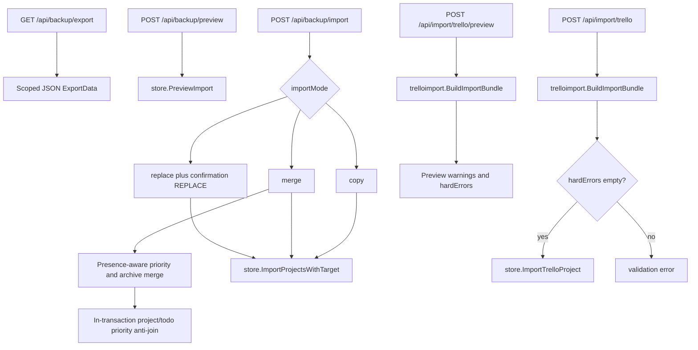
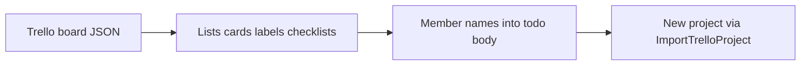

# Backup and import

Project export/restore and Trello JSON import use separate HTTP and store paths.

Native backup: preview via `PreviewImport`; mutate via `ImportProjectsWithTarget` (`replace` / `merge` / `copy`). Replace requires `confirmation: "REPLACE"`.

Export format 1.2 adds presence-aware `archivedAt` while retaining the
presence-aware priority behavior introduced in 1.1. New exports write
`priorityTiers` for every project (`[]` means the four
canonical defaults) and `priorityKey` for every todo (`null` means no
assignment), plus `archivedAt` for every todo (`null` means active). A legacy
1.1 backup may omit these fields. On a matched-project
merge, omitted project definitions and todo assignments are preserved;
explicit arrays replace definitions, explicit todo `null` clears, and a string
assigns. An omitted archival field preserves target state, explicit null
clears archival, and a Unix-millisecond timestamp archives; outside matched
merge there is no target state, so an omitted field creates an active story.
The version gate accepts only 1.1 and 1.2, rejects a 1.1 payload carrying
`archivedAt` as mislabeled, and rejects an `archivedAt` that is negative or
implausibly far in the future. Replacement
and merge run under project-writer serialization and
abort if any effective non-null todo key would not resolve in the project.

Todo exports may include `createdByUserId` as additive historical metadata;
`NULL` attribution is omitted. This value is a database-local user row ID, not
a portable identity. Native replace, merge-new, and copy imports therefore do
not bind the raw number to a user in the destination database, even when a user
with the same numeric ID happens to exist. Imported/newly copied todos receive
`NULL` creator attribution. A merge that updates an already matched todo leaves
that target todo's existing attribution unchanged. Portable creator restoration
is deferred until the backup format carries an identity that can be mapped
without confusing unrelated users.

Trello import uses dedicated `ImportTrelloProject` (not the generic `ImportProjects` path). Preview and import both use `trelloimport.BuildImportBundle`. Import rejects when preview `hardErrors` is non-empty. Body size is capped separately (`MaxTrelloImportBody`).

## Trello transform

Trello members do **not** become Scrumboy assignees automatically; member information is preserved in note text where applicable (see Trello import warnings).

**Card closure and list closure are separate axes.** A closed **card** becomes a first-class
archived story: `archivedAt` is set and the title is left alone — there is no `[Archived]`
title prefix. Trello's export carries no per-card archive time, so every closed card is
stamped with the **import time**. A closed **list** is unrelated to archival: its cards keep
the `[Closed List] ` title prefix and the closed-list/Done column remap, and are not archived.
A card that is both keeps the closed-list prefix and is additionally archived.

Both closure facts are also retained outside the archive flag: the body's `## Trello import
notes` section records `- Archived in Trello: true` for a closed card and `- Original Trello
list: <name> (closed in Trello)` for a closed list, and the per-todo import metadata keeps
`trelloClosed` and `trelloListClosed`.

Backup and Trello import paths do **not** append import audit events. Do not treat imports as audited actions unless product code adds that later.
