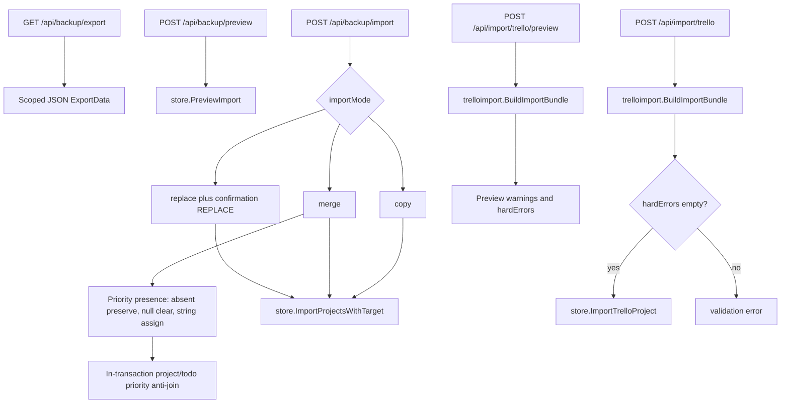
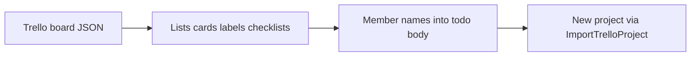

# Backup and import

Project export/restore and Trello JSON import use separate HTTP and store paths.

Native backup: preview via `PreviewImport`; mutate via `ImportProjectsWithTarget` (`replace` / `merge` / `copy`). Replace requires `confirmation: "REPLACE"`.

Export format 1.1 uses syntactic presence for priorities without a version
bump. New exports write `priorityTiers` for every project (`[]` means the four
canonical defaults) and `priorityKey` for every todo (`null` means no
assignment). A legacy 1.1 backup may omit these fields. On a matched-project
merge, omitted project definitions and todo assignments are preserved;
explicit arrays replace definitions, explicit todo `null` clears, and a string
assigns. Replacement and merge run under project-writer serialization and
abort if any effective non-null todo key would not resolve in the project.

Trello import uses dedicated `ImportTrelloProject` (not the generic `ImportProjects` path). Preview and import both use `trelloimport.BuildImportBundle`. Import rejects when preview `hardErrors` is non-empty. Body size is capped separately (`MaxTrelloImportBody`).

## Trello transform

Trello members do **not** become Scrumboy assignees automatically; member information is preserved in note text where applicable (see Trello import warnings).

Backup and Trello import paths do **not** append import audit events. Do not treat imports as audited actions unless product code adds that later.
