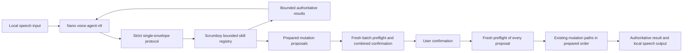
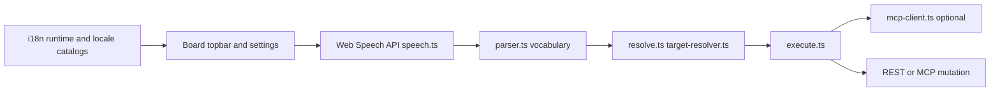
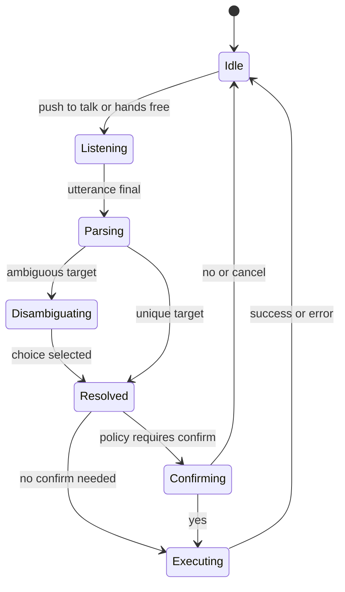

# VoiceFlow pipeline

Optional browser speech shortcuts for board actions (push-to-talk or hands-free). The surrounding board/settings UI localizes with the SPA i18n layer, but command grammar, spoken confirmations, and disambiguation words remain English-centric today.

The enhanced on-device path uses this separate bounded skill loop. The browser/basic diagrams below remain unchanged.

The model selects actions; Scrumboy owns resources, permissions, validation, task handles, confirmation and execution. All proposals pass preflight before any mutation starts. Execution failures stop the remaining operations without a homemade rollback. Keep Listening controls one next-command window after the current task, independently of clarification and confirmation replies.

## Locale boundary

- Board chrome, `Settings -> Customization -> VoiceFlow` copy, and runtime status/error toasts follow the app locale.
- Parser vocabulary, built-in status aliases, spoken `yes` / `no` confirmations, and spoken disambiguation words currently stay English-centric.
- `Safe-Mode` is the safer choice in a non-English UI because the command grammar does not switch with the app locale yet.

## State machine

Preferences (`voiceflow-preferences.ts`) control enabled flag, mode (`safe` | `hands-free`), and Hands-Free confirmation policy (`deletes` default | `mutations`). Under `deletes`, only destructive delete commands require spoken yes/no; under `mutations`, create/move/delete/assign require confirmation; open/edit never does. Disambiguation (pick among matches) is separate from action confirmation. See `docs/voiceflow.md` for command vocabulary.
